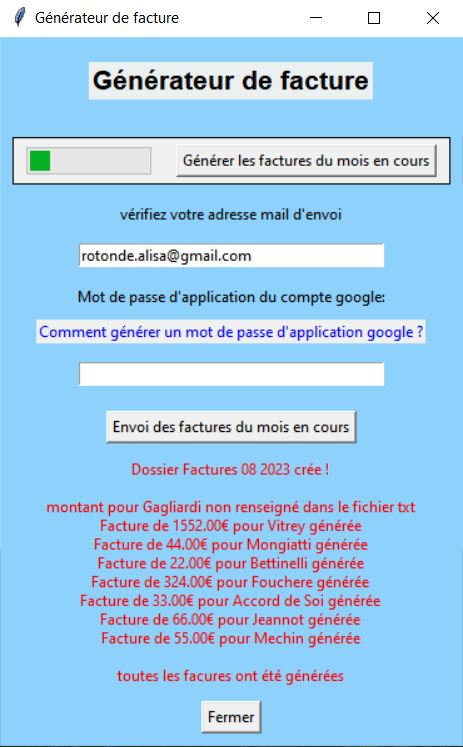
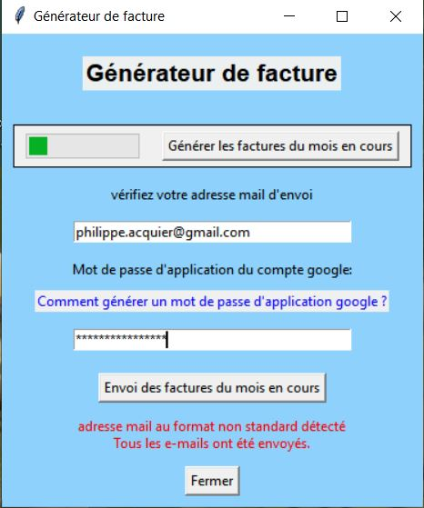

# facturation-avec-incrémentation-automatique

Le logiciel avec GUI réalise les opérations suivantes:
* Dans un dossier donné, il va chercher les numéros de facture pour implémenter à partir de la dernière facture générée
* Chaque mois, il génère des nouvelles factures **seulement** pour les personnes dont le nom est dans le fichier "liste_des_locataires.txt"
* Il crée un nouveau dossier pour le mois en cours avec les nouvelles factures
* Il y a un bouton pour envoyer les mails automatiquement aux personnes concernées (dans le fichier "liste_des_locataires.txt")

